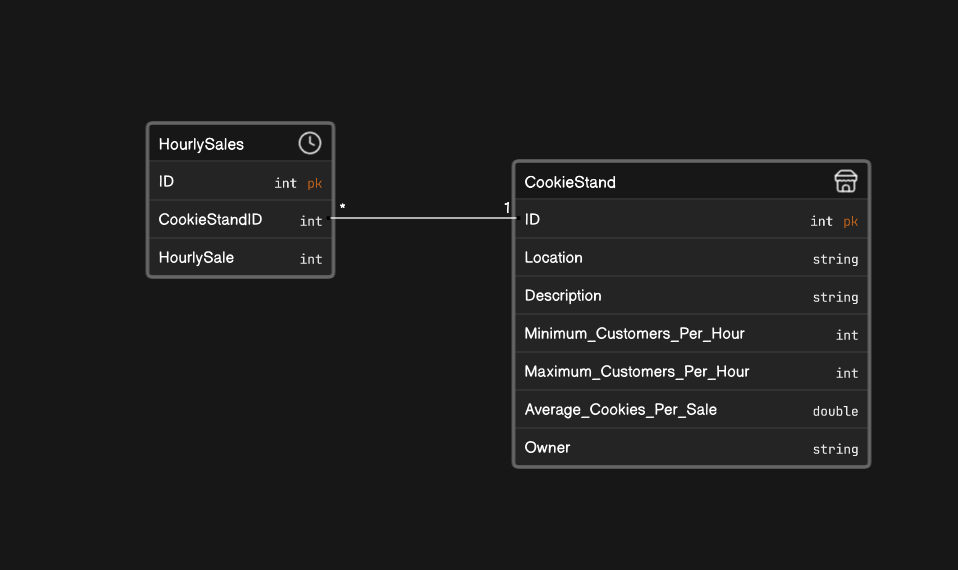

# cookie-stand-api
# CookieSalmon App Documentation

Welcome to the documentation for the CookieSalmon app. This document provides information on how to use the CookieSalmon app, including details on its data structure, services, and functionality. Please refer to this documentation for a better understanding of the app's capabilities.

## Table of Contents
1. [Entity Relationship Diagram (ERD)](#entity-relationship-diagram-erd)
2. [Unified Modeling Language (UML) Diagram](#unified-modeling-language-uml-diagram)
3. [Overview](#overview)
4. [Usage](#usage)
   - [Adding a Cookie Stand](#adding-a-cookie-stand)
   - [Deleting a Cookie Stand](#deleting-a-cookie-stand)
   - [Retrieving All Cookie Stands](#retrieving-all-cookie-stands)
   - [Retrieving a Specific Cookie Stand](#retrieving-a-specific-cookie-stand)
   - [Updating a Cookie Stand](#updating-a-cookie-stand)

## Entity Relationship Diagram (ERD) <a name="entity-relationship-diagram-erd"></a>
The ERD illustrates the relationships between entities in the CookieSalmon app:



## Overview <a name="overview"></a>
The CookieSalmon app is designed to manage information about cookie stands and their hourly sales. It includes the following key classes:

- `CookieStand`: Represents a cookie stand with properties such as location, description, and owner. Each cookie stand can have multiple hourly sales associated with it.

- `HourlySales`: Represents the hourly sales data for a cookie stand. It includes the number of cookies sold in a specific hour.

- `CookieStandService`: A service class that provides methods for interacting with cookie stands and their hourly sales. It includes functionality for adding, deleting, updating, and retrieving cookie stands.

- `CookieSalmonDbContext`: The database context class for Entity Framework, responsible for managing the database and its tables.

## Usage <a name="usage"></a>

### Adding a Cookie Stand <a name="adding-a-cookie-stand"></a>

To add a new cookie stand, use the `AddCookieStand` method in the `CookieStandService` class. Provide the necessary information in the `CookieStandPostDTO` object, including location, description, minimum and maximum customers per hour, average cookies per sale, and owner. The method will generate hourly sales data for the newly created cookie stand.

```
public async Task<CookieStand> AddCookieStand(CookieStandPostDTO cookieStandDTO)

``` 

### Deleting a Cookie Stand <a name="deleting-a-cookie-stand"></a>
To delete a cookie stand and all associated hourly sales data, use the DeleteCookieStand method in the CookieStandService class. Pass the ID of the cookie stand to be deleted as a parameter.

```csharp 
public async Task DeleteCookieStand(int id)
```

### Retrieving All Cookie Stands <a name="retrieving-all-cookie-stands"></a>
To retrieve a list of all cookie stands along with their hourly sales data, use the `GetAllCookieStands` method in the `CookieStandService` class. It returns a list of `CookieStandDTO` objects containing the relevant information.

```csharp
public async Task<List<CookieStandDTO>> GetAllCookieStands()
```

### Retrieving a Specific Cookie Stand <a name="retrieving-a-specific-cookie-stand"></a>
To retrieve information about a specific cookie stand, use the `GetCookieStandById` method in the `CookieStandService` class. Provide the `ID` of the cookie stand as a parameter.

```csharp
public async Task<CookieStandDTO> GetCookieStandById(int id)
```


### Updating a Cookie Stand <a name="updating-a-cookie-stand"></a>
To update the information for a cookie stand, use the `UpdateCookieStand` method in the `CookieStandService` class. Provide the ID of the cookie stand to be updated and a `CookieStandPostDTO` object with the updated information. The method will also update the associated hourly sales data

```csharp 
public async Task<CookieStand> UpdateCookieStand(int id, CookieStandPostDTO cookieStandDTO)
```

Thank you for using the CookieSalmon app. If you have any questions or need further assistance, please refer to the code comments or contact our support team for help.
